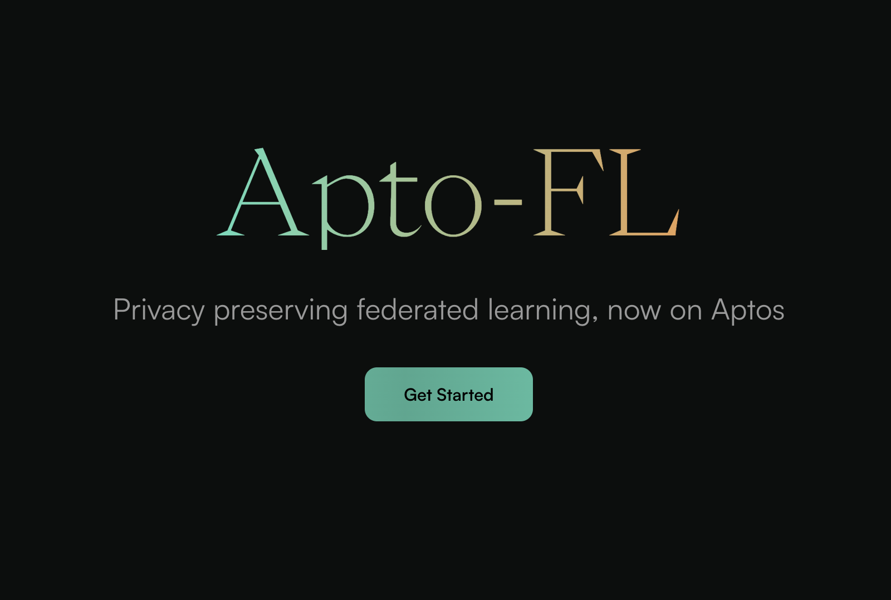
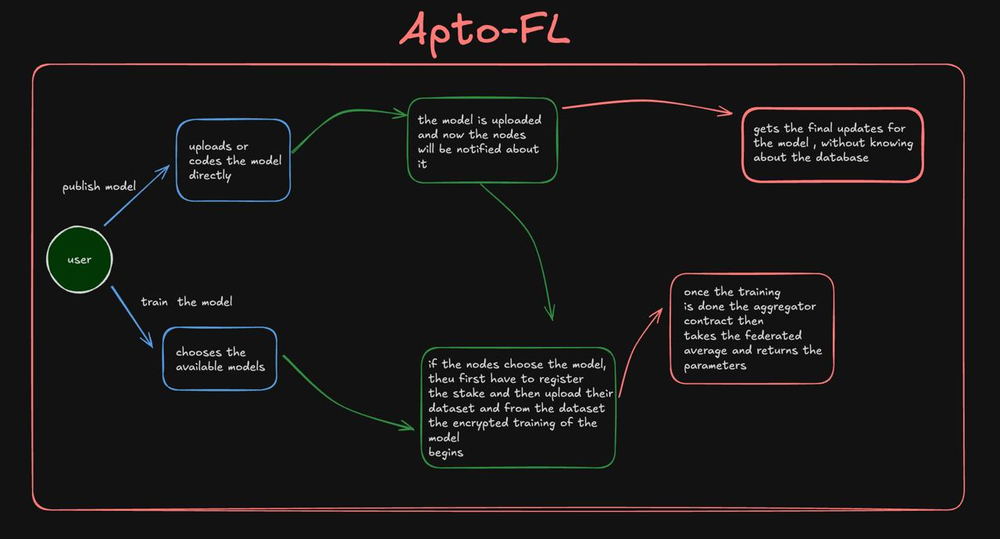

# APTOFL: Federated Learning Privacy-Preserving Platform


<center></img></center>

<p align="center">APTOFL is a decentralized platform built on the Aptos blockchain, enabling secure, privacy-preserving model training on distributed datasets. It ensures that sensitive data remains private by leveraging Pedersen commitments to keep model parameters (weights and biases) confidential during training.</p>

<p align="center">Aptos is used for decentralized coordination, allowing nodes to participate in the training process and enabling on-chain aggregation of encrypted data.</p>

<p align="center"><b>Read our wonderful docs <a href="https://aptofl.gitbook.io/aptofl"> here </a></b></p>


</img>

## Key Features

1. **Blockchain Coordination (Aptos)**  
   The Aptos blockchain is central to orchestrating the training process. It emits events, manages node registration, and handles the aggregation of encrypted data on-chain.

2. **Privacy-Preserving Model Training**  
   Pedersen commitments allow nodes to train models on their local datasets while keeping both the data and model parameters confidential. This ensures that no sensitive information is leaked during the training process.

3. **Decentralized Node Participation**  
   Users can register as nodes to participate in training, leveraging their private data without revealing it to others. This decentralized approach fosters collaborative learning without the need to share data.

4. **Encrypted Aggregation**  
   After nodes train their models and submit encrypted weights and biases, Aptos-based smart contracts aggregate these encrypted values on-chain, ensuring privacy throughout the process.


</img>


## Architecture Overview

1. **Server-Side (Model Provider)**  
   - **Upload Model:**  
     The user (model provider) uploads the model (e.g., linear regression, neural network) and registers it on the Aptos blockchain.

   - **Event Emission:**  
     Once the model is registered, an event is emitted on the Aptos blockchain, notifying all registered nodes that a new model is available for training.

2. **Client-Side (Nodes)**  
   - **Node Registration:**  
     Users can register their wallet address as nodes on the Aptos blockchain.

   - **Data Processing:**  
     When a node listens for the model registration event, it retrieves the model parameters, loads its private dataset, and begins training.

   - **Pedersen Commitments:**  
     The trained model’s weights and biases are encrypted using Pedersen commitments, ensuring confidentiality.

   - **Encrypted Submission:**  
     Nodes submit their encrypted weights and biases back to the Aptos smart contract for aggregation.

3. **On-Chain Aggregation**  
   The Aptos smart contract aggregates the encrypted results from multiple nodes without revealing the underlying data.

4. **Decrypted Results**  
   The model provider retrieves the final encrypted aggregated model and decrypts the weights using their private key.

By utilizing federated learning, APTOFL enables secure, decentralized, and privacy-preserving model training, ensuring that sensitive information remains private and secure across the network of participating nodes.


## Run Locally

Clone the project

```bash
  git clone https:github.com/Sahilgill24/AptoFL
```

Go to the project directory

```bash
  cd AptoFL/apto-fl-ui/ui
  yarn 
```


Start the server

```bash
  cd client_node/model_training
  pip3 install flask
  python3 server.py
```

